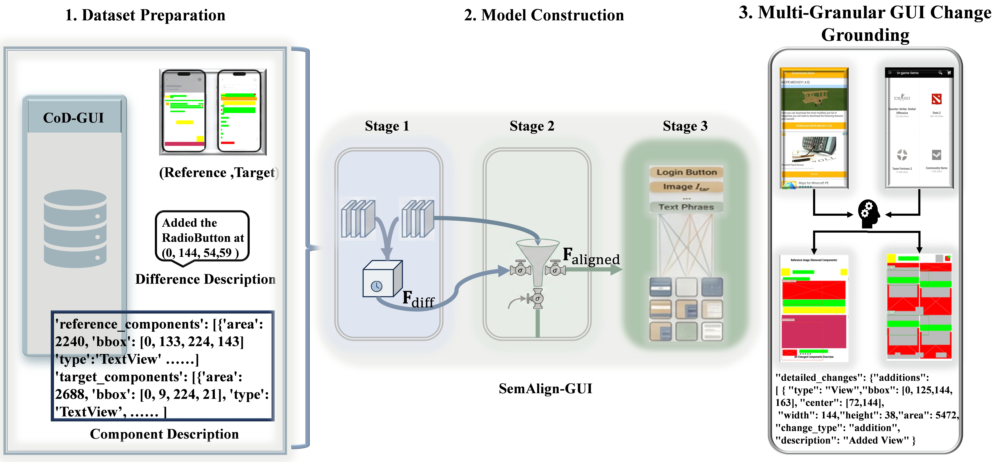

# SemAlign-GUI: Semantic-Aware GUI Change Understanding



<div align="center">

**Bridging the Semantic Gap in GUI Regression Testing via Progressive Multimodal Alignment**

[](你的论文链接)
[](#-dataset-cod-gui)
[](#-implementation)
[](LICENSE)

</div>

---

## 📖 Introduction

**SemAlign-GUI** is a unified framework accepted at **EASE '26**. It redefines GUI change detection as a progressive **multimodal alignment process**, moving beyond brittle pixel comparisons and static vision-language models.

In the era of Agile and DevOps, traditional tools struggle with rendering noise, and generic VLMs (like GPT-4o) lack fine-grained localization. SemAlign-GUI bridges this "semantic gap" by understanding **what changed**, **where it changed**, and **why**.

**✨ Key Contributions:**
* **TRM (Visual-Temporal):** Filters rendering noise via dynamic evolution patterns.
* **AGF (Semantic Alignment):** Fuses visual differences with user intent using adaptive gating.
* **PPCL (Fine-Grained):** Achieves pixel-level localization without expensive bounding box supervision.
* **SOTA Performance:** Outperforms **GPT-4o** and **UI-BERT** on the CoD-GUI benchmark.

---

## 🚀 Method Overview

Our approach mimics human cognitive understanding through three synergistic stages.

### Stage 1: Visual-Temporal Perception (TRM)
Establishes a robust visual foundation by modeling pixel-level evolution patterns.
<details>
<summary><b>Click to expand architecture (Figure 2)</b></summary>

)
*Uses a Temporal Relation Module (TRM) to capture dynamic associations and filter non-semantic noise.*
</details>

### Stage 2: Semantic-Aware Alignment (AGF)
Aligns visual differences with LLM-driven textual intent.
<details>
<summary><b>Click to expand architecture (Figure 3)</b></summary>

)
*Employes Adaptive Gated Fusion (AGF) to dynamically integrate visual, textual, and structural information.*
</details>

### Stage 3: Fine-Grained Grounding (PPCL)
Enforces precise phrase-to-patch localization.
<details>
<summary><b>Click to expand architecture (Figure 4)</b></summary>

)
*Uses Phrase-Patch Contrastive Learning (PPCL) to map abstract semantics to specific visual regions.*
</details>

---

## 💾 Dataset: CoD-GUI

We introduce **CoD-GUI** (Component-oriented Description for GUI), a rigorous dataset derived from Rico-Topic.

| Statistic | Count/Details |
| :--- | :--- |
| **Total Samples** | 45,940 Component-level pairs |
| **Data Format** | HDF5 (Serialized) |
| **Annotations** | Pixel-level masks, Coordinates, Natural Language Descriptions |
| **Download** | **[🔗 Link to Dataset](#)** |

---

## 📊 Performance & Comparison

SemAlign-GUI achieves a new state-of-the-art on the CoD-GUI benchmark.

### Automated Metrics
| Method | F1-Score | IoU | Accuracy |
| :--- | :---: | :---: | :---: |
| ChangeFormer (Vision-only) | 0.679 | 0.561 | 0.743 |
| UI-BERT (Static Multimodal) | 0.742 | 0.630 | 0.800 |
| GPT-4o (Foundation Model) | 0.737 | 0.609 | 0.786 |
| **SemAlign-GUI (Ours)** | **0.889** | **0.824** | **0.926** |

### Visualization
<details>
<summary><b>View Qualitative Results (Figure 5)</b></summary>


*Visualization of verification reports. SemAlign-GUI precisely identifies component shifts (blue arrows) and structural changes.*
</details>

---

## 🛠️ Usage

### Installation
```bash
git clone [https://github.com/anonymous1-cloud/SemAlign-GUI.git](https://github.com/anonymous1-cloud/SemAlign-GUI.git)
cd SemAlign-GUI
pip install -r requirements.txt
